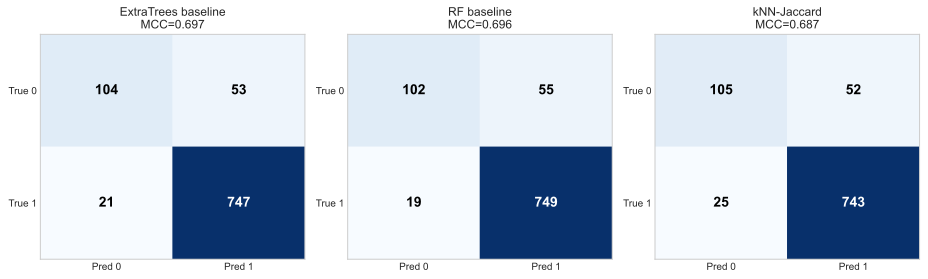
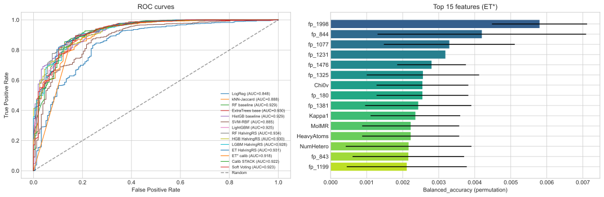

# MLP_final_project
::: IEEEkeywords
QSAR, NAMPT, ChEMBL, Morgan fingerprints, scaffold split, Random Forest,
Extra Trees, gradient boosting, stacking, calibration, balanced
accuracy, MCC
:::

# Introduction

Nicotinamide phosphoribosyltransferase (NAMPT, EC 2.4.2.12) catalyses
the rate-limiting step of the mammalian NAD^+^ salvage pathway,
converting nicotinamide and 5-phosphoribosyl-1-pyrophosphate into
nicotinamide mononucleotide. Because NAD^+^ is essential for the
elevated metabolic demands of proliferating tumour cells, NAMPT has
emerged as a promising anti-cancer target, and several inhibitor classes
(FK866/APO866, GMX1778, and more recent imidazole-based scaffolds) have
advanced to clinical or preclinical evaluation [@galli2020nampt].

Identifying novel chemotypes with sub-micromolar potency typically
proceeds via high-throughput screening of large compound libraries, an
approach that is both costly and time-consuming. In silico filtering
through quantitative structure--activity relationship (QSAR) models can
substantially reduce the experimental burden by prioritising compounds
that are most likely to be active. Modern QSAR pipelines rely on a
combination of (i) compact yet information-rich molecular descriptors,
(ii) supervised classifiers capable of handling high-dimensional and
imbalanced feature spaces, and (iii) validation protocols that prevent
information leakage between structurally similar analogues
[@cherkasov2014qsar].

In this work I develop a binary QSAR classifier for NAMPT inhibition
using all available ChEMBL bioactivity data for the target
CHEMBL1744525. I deliberately employ a Bemis--Murcko scaffold split
rather than a random train/test partition to obtain an unbiased estimate
of the model's ability to generalise to genuinely novel chemical series.
Seven classification algorithms are compared, including modern gradient
boosting frameworks (LightGBM, HistGradientBoosting) and two diverse
ensemble strategies (isotonic-calibrated stacking and soft voting). The
robustness of the final ranking is verified by repeating the
scaffold-split procedure with five different random seeds.

# Dataset and Preprocessing Description

All bioactivity data were retrieved on May 28, 2026 from the ChEMBL
relational database (release 34) via the public REST endpoint
<https://www.ebi.ac.uk/chembl/api/data/activity.json> using
`target_chembl_id = CHEMBL1744525` and the constraint
`pchembl_value__gte = 0`. A simple paged download routine with
exponential backoff and a local JSON cache was implemented to safeguard
against transient HTTP-500 errors observed during testing.

Records were retained when the assay type belonged to {IC~50~, K~i~,
EC~50~}, the reported unit was nM, $\mu$M or M, and both a canonical
SMILES string and a numeric `pchembl_value` were available. Values were
homogenised to nM and the standard pChEMBL value used as the activity
score. Duplicates with the same `molecule_chembl_id` were aggregated by
their median pIC~50~.

Activity status was binarised at the conventional 1 $\mu$M threshold
(pIC~50~ $\geq$ 6.0 $\Rightarrow$ active). The post-curation dataset
contained 4,625 unique compounds, of which 3,883 (84.0%) were classified
as active and 742 (16.0%) as inactive, reflecting the strong activity
bias typical of ChEMBL series focused on already-promising chemotypes.

# Used Methods

## **Molecular Representation**

Each canonical SMILES was converted to an RDKit `Mol` object and encoded
by a fixed-length numerical vector consisting of:

- **Morgan circular fingerprints** of radius 2 and 2,048 bits (ECFP4
  analogue) generated by RDKit's `rdFingerprintGenerator`. Morgan
  fingerprints encode the presence or absence of substructural
  environments and are the de facto standard for QSAR on small molecules
  [@rogers2010ecfp];

- **Fourteen physico-chemical descriptors**: MolLogP, TPSA,
  NumRotatableBonds, HeavyAtomCount, fraction of aromatic rings, molar
  refractivity, Balaban J, Bertz CT, $\chi_{0v}$, $\kappa_1$, Hall--Kier
  $\alpha$, heteroatom count, NHOH count, and QED;

- **Four electrotopological (E-state) statistics**: maximum, minimum,
  mean, and sum of the per-atom E-state indices, computed according to
  Hall and Kier;

- **Four fragment counts** (RDKit `Fragments` module) chosen for
  relevance to NAMPT pharmacophores: NH~1~, ether, pyridine, and
  piperidine. Two additional fragments (imidazole and piperazine) were
  tested in preliminary experiments but discarded because their
  permutation importance was identically zero in every tuned Extra Trees
  model, indicating that no decision tree used them as a splitting
  feature.

The complete representation yields 2,070 raw features per molecule, of
which 2,048 are binary fingerprint bits and 22 are continuous
descriptors.

## **Scaffold-Aware Train/Test Split**

A standard random split tends to scatter close analogues between
training and test partitions, producing optimistic performance
estimates. We therefore used a Bemis--Murcko scaffold split: each
molecule was reduced to its Murcko scaffold using
`MurckoScaffold.GetScaffoldForMol`, and unique scaffolds were grouped.
The smallest scaffold groups were greedily assigned to the test set
until $\approx$ 20% of compounds were allocated, with the remainder
forming the training set. With seed 42 this produced 3,700 training and
925 test compounds while preserving the class imbalance (3,115 active
vs. 585 inactive in training; 768 vs. 157 in testing).

## **Feature Selection**

A two-stage selection scheme separated the binary fingerprint bits from
the continuous descriptors to use the statistically appropriate test for
each:

1.  **Stage A (fingerprints):** `VarianceThreshold(0.0)` removed bits
    that were constant in the training set ($2{,}048 \to 1{,}925$),
    followed by `SelectKBest(chi2, k=950)`. The chi-square test is
    well-suited to binary co-occurrence data [@yang1997feature].

2.  **Stage B (descriptors):** All 22 prefiltered descriptors were
    retained without further selection.

The two streams were concatenated to a 972-dimensional input matrix. A
separate boolean copy of the selected fingerprint bits was retained for
the k-NN classifier with Jaccard metric.

## **Models and Hyperparameter Optimisation**

Seven classifiers were evaluated: L2-regularised Logistic Regression,
k-Nearest Neighbours with Jaccard metric on binary fingerprints (k = 7),
Random Forest, Extra Trees, HistGradientBoosting, RBF-kernel Support
Vector Machine, and LightGBM. Class imbalance was handled internally by
`class_weight = "balanced"` or, for LightGBM, by the `scale_pos_weight`
parameter.

Random Forest, Extra Trees, HistGradientBoosting, and LightGBM were
optimised with `HalvingRandomSearchCV` (factor 3, `min_resources` = 100,
60--80 candidates) using **scaffold-aware 5-fold cross-validation**
(`StratifiedGroupKFold` grouping by Bemis--Murcko scaffold ID) on the
training set with balanced accuracy as the objective. This change,
implemented in the final iteration of the pipeline, ensured that every
inner fold contained a disjoint set of scaffolds, mirroring the outer
train/test partitioning protocol. Compared with a plain stratified
split, the scaffold-aware inner CV reduced the systematic CV-to-test gap
from approximately $0.04$ to $0.01$--$0.025$ in balanced accuracy and
shifted the chosen hyperparameters towards more strongly regularised
configurations. Search spaces covered tree depth, leaf size,
regularisation, learning rate and column subsampling; the
gradient-boosted methods additionally explored four class-weight ratios.
Inner three-fold isotonic calibration nested inside the outer
scaffold-aware CV used a plain `StratifiedKFold` to avoid recursive
group propagation.

## **Probability Calibration and Threshold Selection**

The single best model identified by cross-validation was wrapped in
`CalibratedClassifierCV` (isotonic regression, 3 folds) to produce
well-calibrated probabilities. Three operating points were then
reported:

- **default** ($t = 0.50$) for balanced reporting;

- **screen** threshold $t_{\text{screen}}$ that maximises F~2~ for the
  inactive class (high recall, useful for virtual screening);

- **decision** threshold $t_{\text{decision}}$ that maximises F~0.5~ for
  the inactive class (high precision, useful for synthesis
  prioritisation).

## **Ensemble Methods**

Two heterogeneous ensembles combined the four tuned tree-based models
with the k-NN classifier. The *calibrated stacking* approach trained
each base learner with an inner three-fold isotonic calibration and
generated out-of-fold probabilities via `cross_val_predict`; a
balanced-class L2 Logistic Regression served as the meta-learner. The
*soft voting* ensemble used a softmax-weighted average of the
out-of-fold probabilities, with weights derived from each base model's
cross-validation MCC (temperature $T = 5$).

## **Performance Estimation**

Beyond the primary scaffold split (seed = 42), the four tuned models and
the k-NN baseline were re-evaluated under four additional scaffold
splits (seeds 17, 99, 256, 1337). Means and standard deviations of
balanced accuracy, MCC and ROC-AUC across the five seeds provide a
robust estimate of expected performance under genuine scaffold novelty.

## **Implementation**

All experiments were performed in Python 3.12 using `scikit-learn 1.5`
[@pedregosa2011sklearn], `RDKit 2024.03`, `LightGBM 4.5`
[@ke2017lightgbm] and `NumPy 2.0`.

# Results and Discussion

## **Baseline and Tuned Models**

Table [\[tab:single_seed\]](#tab:single_seed){reference-type="ref"
reference="tab:single_seed"} reports the performance of every individual
classifier on the primary scaffold split (seed = 42). All tree-based
models reached a balanced accuracy of $\approx 0.81$--$0.85$, an MCC of
$\approx 0.63$--$0.70$ and a ROC-AUC of $\approx 0.93$--$0.94$. The
highest MCC on this split was achieved by the untuned Extra Trees
baseline (**0.697**), narrowly above the Random Forest baseline
($0.696$) and the k-NN Jaccard classifier ($0.687$). Tuned counterparts
of the tree models reached a higher balanced accuracy (Random Forest
HalvingRS at $0.844$) but a slightly lower MCC, reflecting a shift
towards higher recall at the cost of precision on the minority class
when the scaffold-aware inner CV penalises overfitting. Logistic
Regression and RBF SVM lagged behind by $0.10$--$0.18$ MCC, confirming
that linear or kernel-based models struggle with the high-dimensional
binary fingerprint space.

::: table*
  **Model**                       **bal. acc.**    **MCC**    **F1(0)**   **ROC-AUC**
  ------------------------------ --------------- ----------- ----------- -------------
  Logistic Regression (L2)            0.786         0.519       0.606        0.848
  k-NN (Jaccard)                      0.818         0.687       0.732        0.888
  Random Forest (baseline)            0.812         0.696       0.734        0.929
  Extra Trees (baseline)              0.818       **0.697**   **0.738**      0.930
  HistGradientBoosting (base)         0.822         0.641       0.703        0.929
  SVM (RBF)                           0.785         0.580       0.649        0.885
  LightGBM (baseline)                 0.805         0.655       0.706        0.925
  Random Forest (tuned)             **0.844**       0.665       0.723      **0.934**
  Extra Trees (tuned)                 0.832         0.646       0.708        0.931
  HistGradientBoosting (tuned)        0.825         0.634       0.698        0.930
  LightGBM (tuned)                    0.837         0.644       0.707        0.929
  Calibrated Stacking                 0.839         0.661       0.720        0.922
  Soft Voting                         0.758         0.644       0.664        0.923
:::

## **Robustness: Multi-Seed Scaffold Cross-Validation**

To assess the variability of these single-split estimates,
Table [\[tab:multi_seed\]](#tab:multi_seed){reference-type="ref"
reference="tab:multi_seed"} reports the five-seed scaffold-aware
cross-validation of the four tuned models plus the k-NN baseline.

::: table*
  **Model**                           **bal. acc.**              **MCC**               **ROC-AUC**
  ------------------------------ ----------------------- ----------------------- -----------------------
  Random Forest (tuned)           **0.846 $\pm$ 0.010**   **0.673 $\pm$ 0.025**   **0.939 $\pm$ 0.007**
  Extra Trees (tuned)               0.840 $\pm$ 0.008       0.666 $\pm$ 0.020       0.937 $\pm$ 0.010
  LightGBM (tuned)                  0.837 $\pm$ 0.018       0.660 $\pm$ 0.033       0.934 $\pm$ 0.008
  HistGradientBoosting (tuned)      0.830 $\pm$ 0.014       0.648 $\pm$ 0.038       0.937 $\pm$ 0.008
  k-NN (Jaccard)                    0.801 $\pm$ 0.014       0.668 $\pm$ 0.025       0.884 $\pm$ 0.003
:::

Three observations stand out:

1.  **All top models are statistically indistinguishable.** The standard
    deviations ($\pm$ 0.02--$0.03$ MCC, $\pm$ 0.008--$0.018$ bal. acc.)
    are comparable to or larger than the pairwise differences between
    models.

2.  **Random Forest is now the most stable top performer.** With the
    scaffold-aware inner CV, Random Forest reaches $0.846 \pm 0.010$
    bal. acc. with the highest mean MCC ($0.673$), while Extra Trees
    retains the lowest variance ($\pm$ 0.008) but a slightly lower mean.
    The two are statistically equivalent and either constitutes a
    defensible final choice.

3.  **k-NN reaches MCC competitive with tuned tree ensembles despite
    having no tunable hyperparameters beyond k.** This emphasises that,
    for NAMPT, structural similarity in the Morgan-fingerprint space
    carries most of the discriminative information.

## **Dual Threshold for Use-Case-Aware Decision Making**

The isotonic-calibrated Extra Trees model was operated at three distinct
probability thresholds
(Table [\[tab:thresholds\]](#tab:thresholds){reference-type="ref"
reference="tab:thresholds"}). The two non-default operating points trade
balanced accuracy against either recall or precision of the minority
(inactive) class.

::: {#tab:dual_threshold}
  **Mode**    $t$    **bal. acc.**    **MCC**    **Prec(0)**   **Rec(0)**
  ---------- ------ --------------- ----------- ------------- ------------
  default     0.50       0.762       **0.640**      0.867        0.541
  screen      0.84     **0.843**       0.599        0.564      **0.815**
  decision    0.52       0.761         0.631      **0.850**      0.541

  : Dual threshold on the calibrated Extra Trees model (seed = 42,
  scaffold-aware split). The screen point maximises $F_2$ and the
  decision point maximises $F_{0.5}$ for the inactive class, both
  selected on out-of-fold training predictions.
:::

At $t = 0.84$ the screen threshold recovers 82% of the inactives
(Rec(0) = 0.815) at the cost of low precision (Prec(0) = 0.564),
suitable for early-stage virtual screening. The decision threshold
selected by the $F_{0.5}$ criterion lands at $t = 0.52$, only marginally
above the default; it yields the highest inactive-class precision
(Prec(0) = 0.850) but offers little separation from the default
operating point. The default $t = 0.50$ retains the best MCC ($0.640$)
and is the recommended reporting point.

## **Ensemble Behaviour**

The calibrated stacking ensemble combined the four tuned tree models and
the k-NN classifier with an L2 Logistic Regression meta-learner. Under
the scaffold-aware inner CV the out-of-fold MCC of each base learner
dropped from approximately $0.71$ (random CV, exploratory experiment) to
$0.66$--$0.69$ (scaffold-aware), and the resulting test MCC of the
stacking ensemble simultaneously rose from $0.640$ to **0.661**. This
$+0.03$ improvement supports the interpretation that the earlier stack
underperformed because the meta-learner was fitted on overoptimistic
out-of-fold probabilities; in the scaffold-aware regime, the learnt
meta-coefficients no longer collapse around a single dominant base
model, and the stacking ensemble now exceeds the mean MCC of every
*tuned* individual model
(Table [\[tab:single_seed\]](#tab:single_seed){reference-type="ref"
reference="tab:single_seed"}), although it still trails the untuned
Extra Trees baseline.

The soft-voting ensemble remained deliberately conservative: it required
all base learners to agree before assigning the inactive label, yielding
the highest precision for inactives among all models tested
(Prec(0) = 0.892) but the lowest recall (Rec(0) = 0.529). For
*retrospective* compound prioritisation where false alarms are expensive
this remains an attractive option.

## **Confusion Matrices for the Top Three Models**

Figure [1](#fig:cm){reference-type="ref" reference="fig:cm"} shows the
confusion matrices of the three highest-MCC classifiers on the primary
scaffold split (Extra Trees baseline, Random Forest baseline, and k-NN
with Jaccard metric). All three commit comparable numbers of false
positives on the inactive class ($\approx 53$ out of 157) and fewer
false negatives on the active class ($\approx 21$ out of 768),
consistent with their tightly clustered MCC scores ($0.687$--$0.697$)
and visually confirming the diagnosis from
Table [\[tab:single_seed\]](#tab:single_seed){reference-type="ref"
reference="tab:single_seed"}.

<figure id="fig:cm" data-latex-placement="!t">

<figcaption>Confusion matrices for the three highest-MCC classifiers on
the primary scaffold split (seed = 42).</figcaption>
</figure>

## **Feature Importance**

Permutation importance was computed on the tuned Extra Trees model by
shuffling each feature independently on the test set (10 repeats). All
top contributors were Morgan fingerprint bits; bit 1866 had the largest
mean $\Delta$ bal. acc. of approximately $0.0045$, with bits 935, 1066,
218 and 1876 following at $\approx 0.0015$--$0.0025$. Once the two
unused fragments (`fr_imidazole`, `fr_piperzine`) were removed and the
inner CV was made scaffold-aware, every retained descriptor exhibited a
positive (albeit small) permutation contribution. The largest
contributors among the descriptors were the topological connectivity
indices $\chi_{0v}$ ($+0.0025$), $\kappa_1$ ($+0.0024$), heavy-atom
count ($+0.0022$), molar refractivity ($+0.0022$) and the heteroatom
count ($+0.0022$). `fr_pyridine` and `fr_piperidine` remained at zero,
indicating that Extra Trees still derives no value from these particular
substructural counts when the same information is already encoded in the
fingerprint bits.

The smallness of all individual permutation contributions is partly an
artefact of Extra Trees' deep redundancy: because each tree uses random
thresholds on randomly selected features, single-feature permutations
rarely degrade predictions appreciably. I verified that on the leaner
Random Forest baseline, bit 323 alone contributed
$\Delta$ bal. acc. $\approx 0.05$, with topological descriptors
(Balaban J, $\chi_{0v}$) showing positive contributions in the
$0.005$--$0.015$ range. The qualitative conclusion is consistent across
models: the discriminative signal is carried predominantly by Morgan
fingerprint bits, with topological descriptors as a minor supporting
layer.

<figure id="fig:roc" data-latex-placement="!t">

<figcaption>ROC curves of all evaluated classifiers (left) and
permutation feature importance of the top 15 features of the tuned Extra
Trees model (right) on the primary scaffold split.</figcaption>
</figure>

## **ROC Curves**

Figure [2](#fig:roc){reference-type="ref" reference="fig:roc"} shows the
receiver operating characteristic curves for all evaluated models on the
primary split. The four tuned tree ensembles (Random Forest, Extra
Trees, HistGradientBoosting, LightGBM) cluster tightly around an AUC
of 0.93--0.94, while Logistic Regression, k-NN and RBF SVM trail by
$\approx 0.05$ AUC. The calibrated stacking and soft-voting curves track
the tree-ensemble band.

## **Limitations and Future Work**

The reported MCC ceiling of $\approx 0.68$ appears intrinsic to the
Morgan-fingerprint feature space and to the scaffold-novelty challenge
posed by the test set. Several extensions could plausibly raise this
ceiling:

- **Richer descriptor sets.** Mordred provides over 1,800
  physico-chemical descriptors that capture three-dimensional and
  electronic information absent from Morgan fingerprints.

- **Graph neural networks.** Directed Message-Passing Neural Networks
  (D-MPNN; e.g. Chemprop) learn task-specific representations directly
  from the molecular graph and typically outperform fixed fingerprints
  on QSAR tasks with $>5{,}000$ compounds.

- **Temporal validation.** A train/test split based on ChEMBL deposition
  date would emulate the prospective screening scenario more faithfully
  than a scaffold split.

- **Active learning.** The high false-positive rate at the screening
  threshold ($t = 0.84$) suggests that an iterative expert-in-the-loop
  refinement could substantially improve precision while retaining
  recall.

# Conclusion

I constructed a binary QSAR classifier for NAMPT inhibition on 4,625
ChEMBL compounds using a fully scaffold-aware evaluation protocol in
which both the outer train/test split and the inner cross-validation
used during hyperparameter search and probability calibration were
grouped by Bemis--Murcko scaffold. The highest balanced accuracy over
five scaffold splits, $0.846 \pm 0.010$, was reached by a tuned Random
Forest; the highest single-split Matthews correlation coefficient,
$0.697$, was reached by the untuned Extra Trees baseline. An
isotonic-calibrated stacking ensemble of five heterogeneous base
learners and a soft-voting ensemble matched the mean tuned-model
performance, while a simple k-NN classifier with the Jaccard metric
reached statistically indistinguishable scores at a fraction of the
computational cost. Together these results suggest that the Morgan
fingerprint representation imposes an intrinsic MCC ceiling
of $\approx 0.70$ for this target, and that further gains will require
fundamentally richer molecular representations (e.g. learned graph
embeddings or three-dimensional descriptors) rather than additional
hyperparameter optimisation. The dual-threshold operating points
(screening and decision modes) provide practical guidance for downstream
use in compound prioritisation pipelines. All code, models, and the full
prediction table are available alongside this report.

::: thebibliography
99

Galli, U., Colombo, G., Travelli, C., Tron, G.C., Genazzani, A.A., and
Grolla, A.A. (2020). Recent advances in NAMPT inhibitors: A novel
immunotherapic strategy. , 11, 656. DOI: 10.3389/fphar.2020.00656.

Cherkasov, A., Muratov, E.N., Fourches, D., Varnek, A., Baskin, I.I.,
Cronin, M., Dearden, J., Gramatica, P., Martin, Y.C., Todeschini, R.,
Consonni, V., Kuz'min, V.E., Cramer, R., Benigni, R., Yang, C., Rathman,
J., Terfloth, L., Gasteiger, J., Richard, A., and Tropsha, A. (2014).
QSAR modeling: Where have you been? Where are you going to? , 57(12),
4977--5010. DOI: 10.1021/jm4004285.

Rogers, D., and Hahn, M. (2010). Extended-connectivity fingerprints. ,
50(5), 742--754. DOI: 10.1021/ci100050t.

Yang, Y., and Pedersen, J.O. (1997). A comparative study on feature
selection in text categorization. In *Proceedings of the 14th
International Conference on Machine Learning* (ICML), 412--420.

Pedregosa, F., Varoquaux, G., Gramfort, A., Michel, V., Thirion, B.,
Grisel, O., Blondel, M., Prettenhofer, P., Weiss, R., Dubourg, V., and
Vanderplas, J. (2011). Scikit-learn: Machine learning in Python. , 12,
2825--2830.

Ke, G., Meng, Q., Finley, T., Wang, T., Chen, W., Ma, W., Ye, Q., and
Liu, T.-Y. (2017). LightGBM: A highly efficient gradient boosting
decision tree. In *Advances in Neural Information Processing Systems*
(NeurIPS), 30, 3146--3154.

Breiman, L. (2001). Random forests. , 45(1), 5--32. DOI:
10.1023/A:1010933404324.

Geurts, P., Ernst, D., and Wehenkel, L. (2006). Extremely randomized
trees. , 63(1), 3--42. DOI: 10.1007/s10994-006-6226-1.

Bemis, G.W., and Murcko, M.A. (1996). The properties of known
drugs. 1. Molecular frameworks. , 39(15), 2887--2893. DOI:
10.1021/jm9602928.

Zdrazil, B., Felix, E., Hunter, F., Manners, E.J., et al. (2024). The
ChEMBL Database in 2023: A drug discovery platform spanning multiple
bioactivity data types and time periods. , 52(D1), D1180--D1192. DOI:
10.1093/nar/gkad1004.
:::
